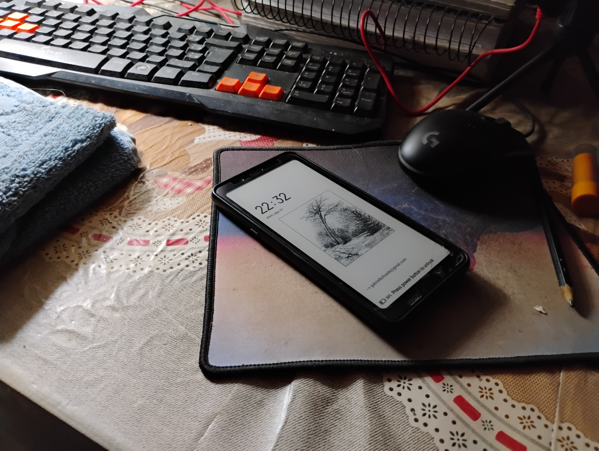

+++
title = 'Minhas experiência usando um celular com tela de Eink'
date = 2025-09-05T21:12:43-03:00
description = ''
tags = ['setup']
draft = false
authors = ['gabriel_chuede']
+++

Em março de 2023 eu comprei um celular com tela de E-ink, uma tela que
se parece com papel e tinta de verdade, usada comumente em Kindles e
leitores digitais. E usei como único celular até esse mês, quando
troquei para um celular comum, especificamente o Motorola G34. Nesse
post vou falar da minha experiência com o celular, por que troquei,
por que comprei e por que todos os celulares são ruins, hoje em dia.

Espero ajudar quem pensa em seguir o mesmo caminho.

## Por que um celular assim seria útil?

Eu parto da filosofia de que um celular deve focar nas poucas coisas
que só são possíveis em um celular e não em um computador, portanto
ele deve ser excepcional em atender mensagens e chamadas, tocar
música, ser um relógio e alarme, e não precisa ser capaz de ver e
interagir com redes sociais ou jogar jogos, se eu quiser fazer isso eu
posso esperar um pouco e usar meu computador, não são coisas que
se beneficiam da instantaneidade que um celular oferece.

Bom, se o celular consegue ter as mesmas capacidades que um
computador, isso é bom e não ruim, porém o que acontece é que
geralmente ele vai perder algumas caracteríticas que ele deveria focar
ao fazer isso, nem que seja em ter um preço muito grande por essas
qualidades a mais, mas também são coisas como aumento das distrações,
perda da bateria, tamanho da tela que impede o uso por apenas uma mão,
etc.

Usando essa lógica para mim fazia sentido um celular possuir esse tipo
de tela: A bateria duraria bem mais, eu poderia substituir dois
dispostivos, kindle e celular, por apenas um, eu teria maior
flexibilidade na escolha dos apps de leitura (como o
[Koreader](https://koreader.rocks/)) e sincronização de
livros, e a tela, sendo preto e branco e com baixa taxa de atualização
me faria ficar menos distraido pelo celular. Whatsapp, app de música,
syncthing, câmera, alarme funcionariam quase que igualmente. Eu não
veria as cores das imagens que me mandam nem das fotos que tirei, mas
se eu acessasse o whatsapp web e as fotos pelo meu computador poderia
ver as cores se realmente precisasse. Fora que achar um celular com
slot para cartão SD, entrada de fone de ouvido e display com altura
menor que 160mm estava cada vez mais difícil de encontrar.

Então comprei ele pelo Aliexpress, antes das taxas, por cerca de 700
reais. Infelizmente tive que pagar impostos da alfândega, mas mesmo
assim estava com um preço acessível. Meu maior medo era o sinal de
telefone não funcionar.

## Por que mudei de opinião

O sinal de celular funcionou para o meu chip Claro, o dispositivo veio
em bom estado, Whatsapp, Google Maps, e outros apps essênciais
funcionaram normalmente, e todos os meus medos iniciais foram
eliminados, porém os problemas estavam em detalhes inpensáveis e uma
mudança na minha visão sobre leitores digitais.

Primeiramente, os problemas mais notáveis foram:

1- a ausência do "player" de música que fica na tela de bloqueio e te
permite mudar a música que você está ouvindo, o qual contornei mais ou
menos com botôes físicos no fone e com a opção de chacoalhar o celular
para mudar de música do [vanilla
music](https://vanilla-music.github.io/);

2- Android bugado e antigo, fechando aplicativos em segundo plano e até
notificações paravam de ser mandadas aleatóriamente, mesmo após
configuração para explicitamente impedir esse comportamento em alguns
apps. No android 9 também tive problemas com o app do Gov.br, que até
instalava mas para o reconhecimento na conta era um sacrifício;

3- Aplicativos de banco não funcionavam por acusação de "root". O que
não seria um problema se os bancos não tirassem a opção de acessar a
conta pelo navegador. O Nubank funcionou sem problemas após pedir no
suporte para liberar o acesso, mas o Sicoob e Viasoft Pay não
funcionaram de jeito nenhum;

4- Display começou a dar "toques fantasma";

5- O celular parecia mandar tudo que era falado para o google, sim
mais do que o que é normal e até te impedia bloquear a câmera da
frente.

Mas a razão pela qual não procurei e não vou procurar novos e melhores
celulares com Eink foi pela minha mudança na visão das vantagens
desses dispositivos.

A bateria não fica tão melhor que a de um celular comum, pois o uso de
um celular é geralmente pouco e envolve atualização da tela constante,
como quando você pega ele para ver uma mensagem recebida. E nessas
situações um display de LCD ou Amoled seria até mais eficiente,
acredito, pois o eink teria que fazer bastante "força" para atualizar
os pixels, enquanto o LCD foi feito para isso. Nos outros momentos a
tela está desligada, sem gastar energia. Até na leitura de livros pelo
celular a diminuição de gasto de energia seria irrisório, pois como a
tela é pequena, poucas palavras cabem na tela e você tem que mudar de
página constantemente.

Outra coisa foi minha ideia de que computadores (desktop ou notebook)
são melhores para leitura do que dispositivos com tela Eink, pois você
tem melhores aplicativos, é mais fácil baixar e fazer anotações, e
tudo fica centralizado, bastando que se faça pausas de tempos em
tempos. Eu não preciso ter acesso aos livros a todo tempo, leituras
feitas fora de casa mais atrapalham do ajudam no entendimento, e eu
acabei usando apenas para livros que eu não leria de outra forma, como
romances, biografias e outros de fácil leitura. O tempo gasto neles
era tão pouco que poderia usar um celular comum e não teria mais danos
aos olhos.

No fim, fazia mais sentido usar um celular comum.

## Todos os celulares são horríveis

Eu estava esperando as mudanças nas leis europeias sobre Right to
Repair e afins, melhorar a qualidade dos celulares antes de comprar o
meu, mas o Hisense ficou inutilizável e tive que comprar um
imediatamente.

Os celulares atuais são grandes (não da para usar com uma mão), sem
slot para cartão SD, sem entrada para fone de ouvido, sem
infravermelho e sem bateria removível. E se tem alguma dessas
características vai pecar em outras. Coisas que eram básicas em
celulares antigos, como o meu J7 metal. E a parte do software também
não está boa, com o android fechando cada vez mais o sistema e o
código. Todos as marcas estão copiando o Iphone, enquanto o Iphone
está focado em ser uma máquina de dinheiro e só depois uma marca de
celulares.

Não faz sentido o celular ter câmeras boas, memória, tela, suporte ao
android por vários anos, se ele é frágil e o conserto não compensa
pois não foi feito com a intenção de ser consertado. Por isso, não
escolha muito e compre qualquer um barato.

Portanto, minha opção foi o Motorola G34, o que não foge da regra, é
grande, não tem infravermelho nem bateria removível, mas é
relativamente barato, tem NFC, android atualizado, entrada de cartão e
fone e tem suporte oficial do [Lineage OS](https://lineageos.org/), o
que testarei após algum tempo. Tenho medo de que os aplicativos de
banco não funcionem, o que o tornaria inutilizável. Minha impressão
até agora é positiva, dadas as condições gerais dessa indústria.
