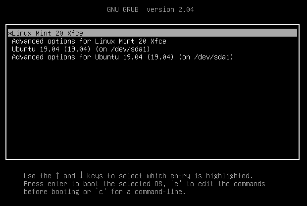
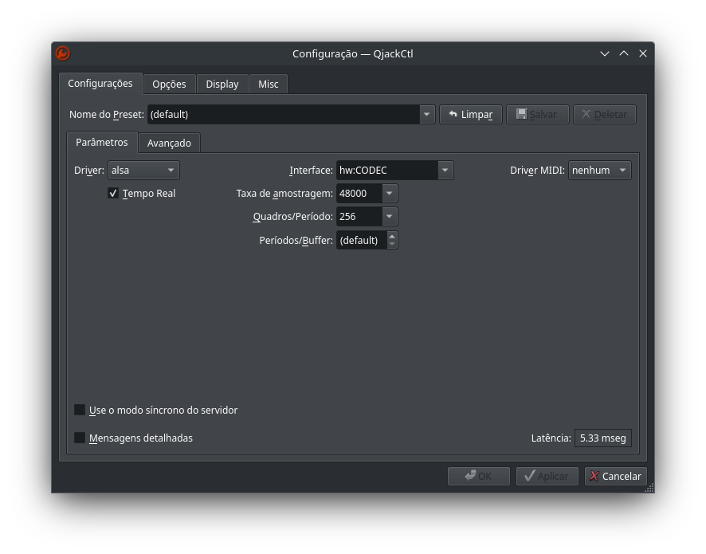
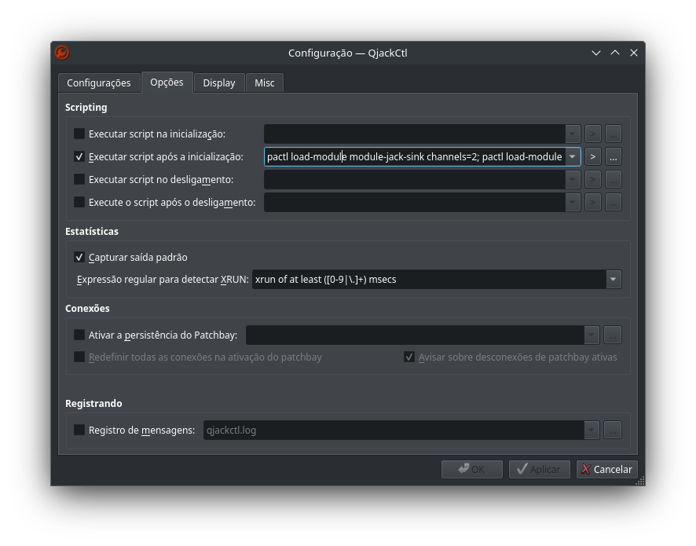
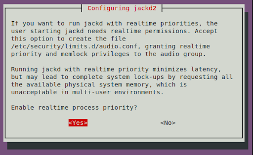

+++
title = 'Configurando linux para produção de áudio'
date = 2025-04-14T22:39:55-03:00
description = 'Passo a passo da configuração do Linux Mint e Debian para gravar e produzir áudio'
tags = ['linux', 'audio', 'guia']
draft = false
authors = ['rafael_chuede']
+++

# Linux e Áudio
Esta postagem tem como objetivo te ajudar a configurar o linux para gravação e produção de áudio, desde a instalação do kernel de tempo real até a utilização de plugins vst do windows. O processo é bem simples, estou usando Debian 12 com KDE, mas é praticamente a mesma coisa para Linux Mint e semelhantes.

## PipeWire vs PulseAudio
Estou acostumado a usar PulseAudio como sistema de áudio casual e intercalar com Jack quando vou gravar e nunca tive problemas, por isso se sua distro contém PipeWire como sistema de audio padrão e você quer continuar a seguir este tutorial siga estes passos: 

verifique se o PipeWire esta instalado rodando no terminal o comando: \
```pipewire --version``` 

Se o terminal retornar a versão do pipewire então primeiramente instale o pulseAudio:\
```sudo apt install pulseaudio``` 

Após instalar o pulseaudio, remova o PipeWire:\
```sudo apt purge pipewire```
## Grupo Audio
Adicione seu usuario ao grupo de audio com: ```sudo adduser SEU_NOME_DE_USUARIO audio```
## Instalação do kernel RT
Para ter o minimo de latência na gravação de instrumentos e vozes, é interessante estar utilizando um kernel de tempo real, Normalmente em distros como linux Mint apenas ```sudo apt install linux-lowlatency``` resolve e instala a versão atual do kernel realtime, se isso não funcionar você pode imprimir no terminal qual a sua versão do kernel com ```uname -a``` (a versão é geralmente os primeiro números, como "6.1.0-33") e depois procurar pela versão realtime do kernel listado com ``` apt search linux-image-VersãoDoKernel-rt``` aparecerão algumas sugestões e voce deve instalar algo como  'linux-image-x.x.x-xx-rt-amd64'. Não se preocupe, se você instalar a versão errada pode voltar facilmente para a que está usando agora e tentar instalar novamente.
### Entre na distro com kernel rt
Reinicie o computador, antes de entrar na tela de login da sua distro, aparece uma tela que contem algumas opções, selecione 'advanced options' e depois a nova versão instalada do kernel. 

## Instale os programas necessários
Os programas instalados são: 
- jackd2: Daemon de audio em tempo real, imprescindível para gravar guitarra por exemplo.
- qjackctl: programa para ativar e configurar o jack com gui. 
- pulseaudio-module-jack: Programa que permite a utilização do jack junto com  pulseAudio, útil para conseguir ver um vide no youtube ou escutar áudio fora da DAW enquanto estiver com ela aberta.

Você pode instalar todos esses programas de uma vez com: \
```sudo apt install jackd2 qjackctl pulseaudio-module-jack```
## Prioridade RealTime
no terminal, com o editor de sua preferência navegue até o arquivo '/etc/security/limits.d/audio.conf', usarei o Nano, `sudo nano /etc/security/limits.d/audio.conf` e adicione as linhas no final(se já não houver no arquivo):
```
@audio - rtprio 99
@audio - memlock unlimited
```


É possivel que o arquivo 'audio.conf' não exista ou, exista algo como 'audio.conf.disabled', neste caso você deve criar ou renomear este arquivo para 'audio.conf', lembre-se de adicionar o conteúdo mencionado acima.
## Configuração QJackCtl

Abra o programa QjackCtl, e vá em configurar, depois em 'interface' escolha a sua interface. Em taxa de amostra e Quadros/Periodo, eu costumo deixar com os valores 4800 e 256 respectivamente, mas isso não é uma regra e depende um pouco da sua interface e poder de processamento do pc, você sempre deve mirar em deixar configurado de um jeito que a latência(mostrada no canto inferior direito) fique menor que 15ms e o áudio escutado não contenha artefatos. Ah não esqueça de ativar a opção 'Tempo Real'.


Para ver vídeos ou escutar áudio fora da DAW quando ela estiver aberta, você deve ir em (nas configurações QJackctl) 'opções', marcar o checkbox 'executar script após a incialização:' e colar ao seu lado esse comando: 

`pactl load-module module-jack-sink channels=2; pactl load-module module-jack-source; pacmd set-default-sink jack_out` \

Esse comando faz com que o module-jack seja ativado ao iniciar o jack.\
Agora sempre que for abrir uma DAW para gravar músicas, primeiro inicialize o jack através do QjackCtl.
## Permitir o usuário jack tempo real
Rode o comando e em seguida "yes".\
	`sudo dpkg-reconfigure -p high jackd2`


## FIM

Você já pode abrir sua DAW(primeiro confira se o QJackCtl está ativado) e gravar usando sua interface sem delay.

[Veja como usar plugins vst no linux!](/posts/vst-plugins-no-linux)
