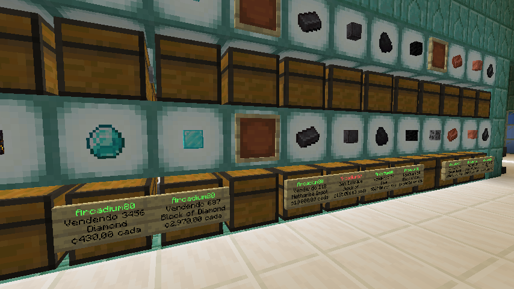
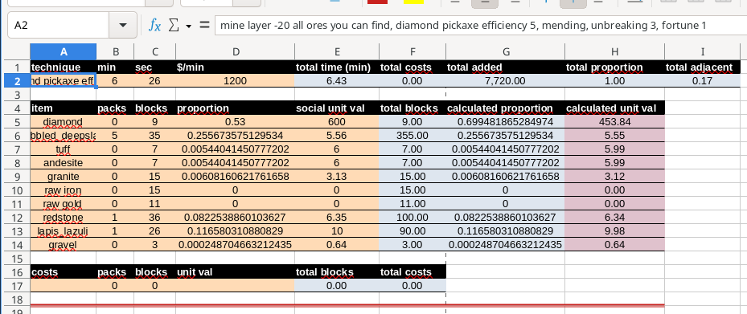

+++
title = 'Crítica à economia política do Minecraft'
date = 2026-01-10T18:19:40-03:00
description = ''
tags = ['economia', 'jogos']
draft = false
authors = ['gabriel_chuede']
+++

Estive vendo que muitas discusões estão aparecendo, principalmente em
inglês, sobre conceitos econômicos ligados ao jogo Minecraft. Coisas
como qual a melhor moeda em um servidor para se realizar trocas, seria
o diamante? o ouro? estrelas do nether[^netherstar]? deveria existir
um governo no servidor para impedir que dinheiro fosse falsificado?
uns dizem que sim[^pinecone][^netherstar], outros que não[^austriac].

Nos ultimos anos, estive tentando entender como a economia funciona no
minecraft, testando minhas teorias em um servidor real, e procurando
recursos na internet que falavam sobre. Não tive as mesmas perguntas
que estão tendo nos vídeos atuais, pois foi antes, mas acredito que
posso esclarecê-las com minha experiência. Primeiro vou falar minha
conclusão geral e depois vou dar alguns detalhes interessantes mas que
são mais perguntas específicas sobre como vender as coisas, como medir
e calcular os preços de forma prática, que embora não sejam tão úteis
ao minecraft, como vou falar, ainda podem ser úteis para entender a
vida real e para quem quiser testar as teorias economicas no mine.

Bom, a conclusão é que no Minecraft moedas/dinheiro não funcionam,
assim como mercados e trocas de mercadorias. Isso acontece pois os
jogadores tem os "meios de produção", se eles quiserem eles podem
fazer tudo, basta achar algum canto não explorado, pegar umas
madeiras, e ir fazendo as coisas aos poucos. Todo mundo sabe que, no
fim, podem eles mesmos fazer tudo que está sendo vendido. Claro, os
jogadores inciantes podem não ter a mesma eficiencia que um jogador
antigo, que tem maquinas de redstone, armaduras encantadas, etc. Mas o
jogador iniciante sabe que pode conseguir tudo sozinho se quiser, e se
ele for trabalhar para o outro pois consegue mais dinheiro, e
consequentemente recursos, ele só fará por um curto período de tempo,
até chegar num nível parecido como jogador antigo. Diferente da vida
real, onde não podemos ir para uma floresta e conseguir nossa própria
comida, nossa própria casa, ou um carro. Primeiro por que a maioria
das florestas e terras são propriedade privada de alguém e mesmo que
não fossem, fazer as coisas exige conhecimento e cooperação que foram
conseguidos durantes milênios de evolução humana. Ninguém consegue
fazer nada sozinho. Nesse sentido minha conclusão é um pouco parecida
com a desse vídeo[^joyful] e mais ainda com a desses outro
vídeos[^thoughtslime][^sompel].

Mas a divisão do trabalho não deveria gerar uma produção maior para
todos os envolvidos e portanto valeria a pena trocar coisas no mercado
onde cada um se especializaria em algo?

Sim, a divisão do trabalho faz com que o total produzido seja maior,
porém o problema está em usar o mercado como meio de
distribuição. Usar o mercado é ruim pois os envolvidos ficam
dependentes dos outros, e seria muito mais arriscado produzir algo muito
específico, seja barras de ferro, do que produzir items essenciais,
como comidas, armas. Se um dia o produtor de comida decidir não vender
mais, toda o mercado quebra, como bem disse o KCJ[^kcj], porém, ao contrário
do que ele propôe (aceitar o risco), a solução natural é outra.

E não faz muito sentido trabalhar somente para que o seu tempo de
trabalho seja trocado pelo mesmo tempo de trabalho só que em outras
formas. Sem lucro algum. E é isso que aconteceria pois o preço teria
que ser igual ao tempo de trabalho necessario para produzir a coisa, e
como ninguem trabalharia para ninguem por menos do que o tempo
trabalhado, ninguem ganharia mais que o tempo trabalhado.

Faz muito mais sentido trabalhar em conjunto, cada um em sua
especialidade, e depois distribuir os produtos em conjunto, de comum
acordo, feito antes ou depois da produção. Desse modo não há riscos e
o produto pode ser distribuido de forma mais inteligente do que cada
um com sua parte exata, algo como deixar 10% para fazer uma máquina
de redstone em um setor que vai aumentar a produtividade grandemente.

Isso para não falar que ninguem vai ficar jogando Minecraft e produzir
a mesma coisa o tempo todo, só para aumentar o output. Produzir só
ferro o tempo inteiro que joga minecraft, é ridículo. Parte do motivo
de jogar é se divertir, que envolve aprender e fazer coisas novas.

Mas, resumindo, as trocas através de mercados só ocorrerão em raras
ocasiões, nas sobras de itens de alguma farm, ou itens que não se tem
uso, portanto de um modo inconstante e não confiável. Os preços podem
ser aleatórios, mas se não forem, usarão a lógica do tempo de
trabalho, portanto sem lucros para ninguém.

A moeda usada, se não tiver uma oficial do server, será difícil de
conseguir, mas provavelmente será algo como o diamante, na verdade
qualquer item 'stackavel' poderá ser usado, geralmente o melhor é um
que não precise de muitos para expressar o valor das outras coisas,
portanto algo que tenha tempo de trabalho para ser conseguido
relativamente alto. O diamante se encaixa nisso pois não se tem ainda
forma de conseguí-lo que reduza muito o seu tempo de trabalho (seu
valor). Mas poderia ser qualquer outra coisa com as mesmas
qualidades. O papo de "ter de ser uma coisa
escassa"[^austriac][^menotbad] é furado, pois escassez é sempre
definido da maneira que lhe convém no momento, pois se você definir
como escassez a quantidade de tal item no universo, nada no minecraft
é realmente escasso. O que realmente importa é quanto tempo de
trabalho leva para conseguir aquela coisa. Mas isso também tem um
papel pouco importante no caso do item usado como moeda, é importante
somente no sentido de não precisar trocar centenas de items para
conseguir um item básico. A utilidade do item nem a escassez importam
para a moeda, como disse o KCJ[^netherstar] e Pinecone[^pinecone],
porém o governo também não importa ao contrário do que eles disseram.

O vídeo do ImMrPibb[^immrpibb] diz usar conceitos austríacos porém
suas conclusões são bem diferentes do que vejo defensores dos
austríacos defenderem, ele leva o tempo como medida do valor. O que
estaria quase certo se o minecraft realmente fosse igual a vida real,
mas como expliquei antes esse não é o caso.

Portanto, não precisa de um governo para impor uma moeda, mas também
não precisa de moedas em geral, mercados serão minoritários e de pouca
importância ou irracionais.

## Detalhes

A primeira coisa a se notar, se seu servidor tem moeda oficial, é os
preços que os NPCs vendem as coisas na loja. Esse é o jeito mais
direto para conseguir dinheiro. Vender coisas para os NPCs. Mas como
são os preços nas lojas? no meu caso percebi que os preços para vender
era sempre bastante inferior ao preço para comprar.

Normalmente as pessoas não pensam em tempo de trabalho, quando vão
formar os preços, mas como eu sei que vai acabar caindo nisso, através
da competição, já decidi fazer uma planilha para contabilizar os tempo
de trabalho para produzir as coisas e colocar o preço com base no
tempo de trabalho, para conseguir o máximo de vendas, mesmo que não
com tanto lucro quanto poderia, desse jeito vai acelerar mais as
coisas.

Disso vem a questão: quanto tempo expressa 1$? e como saber isso?
minha conclusão foi que o tempo de trabalho equivalente a 1$ seria o
tempo para produzir o item acessível a todos e que produz mais
dinheiro vendendo na loja. E no meu caso conclui que era os items de
drop de guardians. Isso por que as farms de guardian eram bastante
populares e qualquer um podia ir farmar guardians em warps
públicas. Então fiz uma média de quantos drops podia conseguir nas
warps por tempo, e então quanto de dinheiro conseguia vendendo essa
media na loja oficial. e dividindo o dinheiro pelo tempo consegui o
valor em tempo de 1$.

Outra questão que surgiu foi de quais items poderia vender e quais não
poderia. A resposta é que você deve fazer uma planilha e colocar todos
os items vendidos, tanto por players quanto a loja oficial, e colocar
apenas o melhor preço, o preço mais barato para se comprar nessas
lojas. Esse vai ser o preço que vai decidir se voce pode ou não
vender. Afinal, se voce não conseguir produzir a um preço menor que
eles você não venderá, as pessoas vão ir nessa loja que vende mais
barato.

Agora, como medir o preço que voce consegue produzir? Você terá que
testar todas as combinações de items, ou as que pareçam fazer sentido,
para tentar produzir as coisas e marcar o tempo levado e os items
conseguidos, além de medir algumas seções e fazer a média das seções
pois tem bastante a questão da sorte ao minerar ou achar animais por
exemplo. Esse youtuber[^backdraft] exemplifica um pouco. Mas o diabo
mora nos detalhes, você terá que contabilizar também a depreciação das
ferramentas, os itens gastos, isso tudo em tempo de trabalho, para
isso você deve usar a durabilidade das ferramentas com e sem
encantamentos [^pickaxe][^unbreaking], e técnicas usando reparação
através de bigornas para ver se é mais eficiente[^anvil]. E para isso
você deve usar o preço mais barato dessas coisas que você marcou na
planilha.

Outro problema é que muitas coisas vão ser produzidas "em
conjunto". Você quase nunca vai minerar apenas ferro, mas sim ferro,
pedra, diamante, redstone. É mais eficiente desse jeito. Mas como
contabilizar o tempo de trabalho de cada coisa se várias coisas foram
produzidas ao mesmo tempo? A solução que encontrei para isso é dividir
o valor gerado no total, o tempo de trabalho total, entre os diversos
items produzidos, mas com proporções, não divisão igualitária. E você
deve ir alterando as proporções de modo a tentar deixar os preços como
os preços baratos das outras lojas, questão de tentativa e erro para
achar essas proporções. A contabilidade vai ficando complexa. Esse
youtuber[^raichu] fez algo parecido, porém não calculou a depreciação
e não usou as proporções, apenas dividiu o valor igualmente entre os
tipos de minérios obtidos, o diamante então só tem valor maior pois
foi encontrado menos e o valor vai ser dividido menos items, porém se
tiver muitos tipos de itens encontrados o valor do diamante pode
acabar ficando bem pequeno.

É normal não conseguir produzir nada no preço mínimo aceitável, então
você deve ir tentando técnicas mais eficientes, procurar na internet
farms e técnicas de produção e ver se elas te permitem produzir com o
"preço socialmente aceitavel".

Você não deve comprar coisas na sua loja mesmo que sejam pelo preço
social, pois sempre corre o risco de uma nova técnica mais eficiente
surja e eles vendam tudo para você, você ficando no prejuizo pois
agora a coisa está valendo menos.

Tem também o problema de interdependencia de items. Por exemplo, se o
item A depende do item B para ser produzido e o item B depende do item
A, como calcular o preço? pode-se usar o preço social do A para
calcular o B ou vice-versa, porém se você tentar produzir os dois
items, A e B, nunc saberá se pode usar a sua própria produção dos dois
items ao invés de comprar de fora.

Portanto, a contabilidade feita é bem complicada. Até para uma
planilha fica ruim de usar, o certo seria fazer um aplicativo para
medir o tempo, usar os preços sociais, a depreciação, etc. talvez eu
tente fazer algum dia.

Mas o que vai acontecer é que provavelmente você não vai conseguir
vender nada, os preços dos outros sempre vão ser menores. Isso ocorre
pois, como eu disse, os mercados são minoritários e as pessoas
simplesmente não ligam muito para o preço que colocam, e podem ficar
"perdendo dinheiro e tempo" quase que infinitamente.

> **Observação**
> Fiz um programa para ajudar nos cálculos dos preços, mesmo que não se tenha
> economia no minecraft ainda é útil para aprender sobre a economia da vida real: [https://github.com/GabR36/MinePriceCalc](https://github.com/GabR36/MinePriceCalc)

## Referências

[^raichu]: JohnnyRaichu, Minecraft: Economics Ep 1: How much is Time worth?, (10 de maio de 2016). Acesso em: 13 de junho de 2024. Online Vídeo. Disponível em: https://www.youtube.com/watch?v=k8HDNGQIMQQ

[^pickaxe]: “Pickaxe”, Minecraft Wiki. Acesso em: 15 de junho de 2024. [Online]. Disponível em: https://minecraft.fandom.com/wiki/Pickaxe

[^unbreaking]: “Unbreaking”, Minecraft Wiki. Acesso em: 15 de junho de 2024. [Online]. Disponível em: https://minecraft.fandom.com/wiki/Unbreaking

[^anvil]: “Anvil mechanics”, Minecraft Wiki. Acesso em: 17 de junho de 2024. [Online]. Disponível em: https://minecraft.fandom.com/wiki/Anvil_mechanics

[^backdraft]: Backdraft, How Much to Charge For Minecraft Items - Minecraft Tutorials in 3 minutes or less | Minecraft 1.17, (8 de setembro de 2021). Acesso em: 13 de junho de 2024. [Online Vídeo]. Disponível em: https://www.youtube.com/watch?v=jDkP0fQp38E

[^netherstar]: KCJ, Nether Star Backed Securities Are The Ideal Minecraft Currency, (8 de dezembro de 2025). Acesso em: 11 de janeiro de 2026. [Online Vídeo]. Disponível em: https://www.youtube.com/watch?v=tteP7kdjiMg

[^austriac]: ImMrPibb, Why EVERY Minecraft Economy Video Is Wrong, (2 de janeiro de 2026). Acesso em: 2 de janeiro de 2026. [Online Vídeo]. Disponível em: https://www.youtube.com/watch?v=AQTFWWbsIDo

[^pinecone]: PineconeLP, The Best Minecraft Server Currency, (25 de novembro de 2025). Acesso em: 11 de janeiro de 2026. [Online Vídeo]. Disponível em: https://www.youtube.com/watch?v=Qe6iDsNusMk

[^kcj]: KCJ, The Opportunity Cost of Singleplayer, (13 de dezembro de 2025). Acesso em: 29 de dezembro de 2025. [Online Vídeo]. Disponível em: https://www.youtube.com/watch?v=pnUGT9IV9cg

[^thoughtslime]: Thought Slime, Fake Economies in Minecraft, (24 de abril de 2020). Acesso em: 24 de junho de 2024. [Online Vídeo]. Disponível em: https://www.youtube.com/watch?v=kpSVG3PyWv0

[^joyful]: Joyful, The Problem with Minecraft’s Political Economy, (17 de julho de 2025). Acesso em: 19 de julho de 2025. [Online Vídeo]. Disponível em: https://www.youtube.com/watch?v=LIS1QrLW2Mg

[^menotbad]: MeNotBad, The ACTUAL Best Minecraft Server Currency, (15 de dezembro de 2025). Acesso em: 11 de janeiro de 2026. [Online Vídeo]. Disponível em: https://www.youtube.com/watch?v=t7JDgDe42q4

[^sompel]: Mo Van de Sompel, Why Minecraft Currency CAN’T Work, (10 de janeiro de 2026). Acesso em: 11 de janeiro de 2026. [Online Vídeo]. Disponível em: https://www.youtube.com/watch?v=ytAYgzk3VU8

[^immrpibb]: ImMrPibb, So.. what is THE BEST CURRENCY in Minecraft?, (10 de janeiro de 2026). Acesso em: 10 de janeiro de 2026. [Online Vídeo]. Disponível em: https://www.youtube.com/watch?v=h7xNCfcdtos
