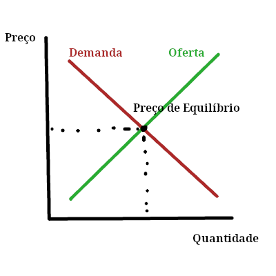

+++
title = 'M-Mas... a oferta... e a... demanda! ☝️🤓'
date = 2025-03-27T23:10:27-03:00
description = 'Por que a oferta e demanda é usado de forma errada e qual a solução'
tags = ['economia']
draft = false
authors = ['gabriel_chuede']
+++

O conceito de oferta e demanda Walrasiano basicamente diz que compradores e
vendedores de uma mercadoria vão dizer os preços que querem comprar e
vender respectivamente essa mercadoria, e quando a quantidade de
compradores e vendedores pelo mesmo preço for igual, haverá trocas, ou
seria o ponto ideal de equilibrio, e os outros compradores e
vendedores que não atingiram esse ponto vão aumentar ou diminuir seus
preços para se aproximar desse valor.

Nesse artigo, tentarei expor da forma mais simples possível por que
esse conceito é usado de forma tão errada, e como usar da forma certa.

E esse conceito se mistura com a oferta e demanda muito usada
popularmente, na mídia, etc. para se referir ao aumento de preços:
Houve aumento de demanda de máscaras na pandemia, o que explica o
aumento no preço das máscaras.

O que por si só já é bem confuso: mais pessoas querem máscaras, mas
isso não diz muito sobre a que preço elas demandam as máscaras. Se
mais pessoas passarem a demandar máscaras por um preço abaixo do preço
atual, significaria que os preços de mácaras, se o preço é decidido
pela oferta e demanda Walrasiana, deveria abaixar, não aumentar, não é
mesmo?

Mas mesmo que assumamos que toda a curva da demanda, nesse exemplo,
seja 'aumentada', e o preço de equilibrio então vai ser mais alto de
fato, isso ainda não ajuda em quase nada na tentativa de descobrir por
que os preços são o que são. Pode até explicar, sofrivelmente, o aumento ou
diminuição de preços, mas não consegue explicar a grandeza que os
produtos ficam. Por que o preço de uma maçã fica por volta de 5 reais,
um carro por volta de 20 mil reais, um computador por 2 mil reais?

A grandeza do preço vai depender da grandeza da curva da demanda e da
grandeza da curva da oferta. Afinal, diferentes produtos tem crises de
demanda e oferta bem similares, entretanto não ficam com o mesmo
preço, eles só aumentam ou diminuem em cima de um preço 'base'.

Então, no final das contas, as pessoas vão precisar se voltar ao tal
preço subjetivo, que vem da valoração subjetiva das pessoas e que vai
ditar a grandeza das curvas da demanda e da oferta de diferentes
produtos. Explicando suas diferenças.

Porém, só falar que o preço do produto é X porque os consumidores e
produtores quiseram não é muito interessante, pois se é subjetivo não
precisamos de teoria economica nem economistas para nada, afinal não
tem como prever o subjetivo. Então vão falar que essa valoração
subjetiva é afetada por outros fatores, como a escassez do produto, os
custos de produção, etc. Mas se recusam a falar bem como esses fatores
se relacionam e funcionam entre si, não existe uma teoria que diga: se
situação x, a escassez vai funcionar de modo y com os custos de
produção - que é circular, mas não importa - e vai formar o preço
Z. Mas isso não é feito. Se as variáveis afetam o preço, você tem que
dizer exatamente como eles se relacionam, ou não terá nenhum valor, é
apenas uma confusão. Se não houver um jeito de teorizar e depois medir
empiricamente, não importa quais variaveis são, poderia muito bem
dizer que os preços são afetados pela decisão de deus, que teria o
mesmo efeito, apenas não é tão bom para convencer as pessoas e as
confundir.

Mas então, qual é a solução?

Tratar a oferta e demanda como influenciadores da produção, e tirar a
parte 'monetária' da equação. As pessoas simplesmente querem ou não
querem dada coisa, elas não pensam "eu quero essa coisa por 2 reais,
essa outra coisa por 1000 reais". E o tanto de pessoas querer algo ou
não pode e vai influenciar a cadeia de produção dessa coisa: se muito
mais pessoas passam a querer essa coisa, vão ter que se fazer novas
fábricas, passar a importar essa coisa de outros países, e com isso o
esforço para conseguir essa coisa vai ser maior, o que vai fazer o
preço ficar maior. Pode, com isso, não afetar as condições de
produção, como no caso de softwares, onde escalar é muito mais fácil,
e o preço não mudar.