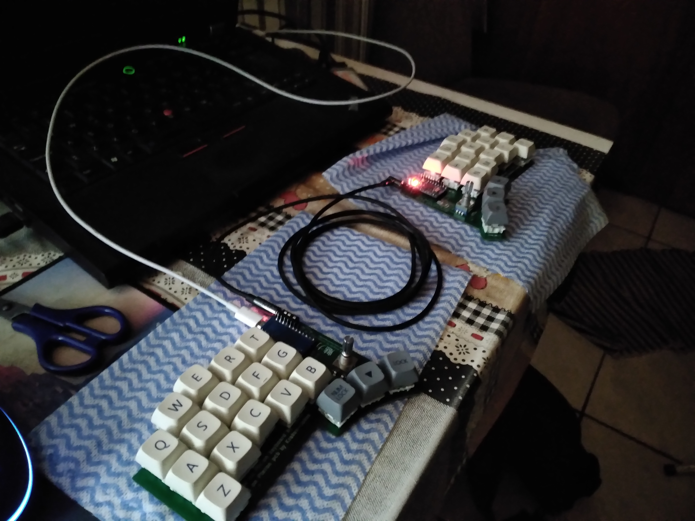
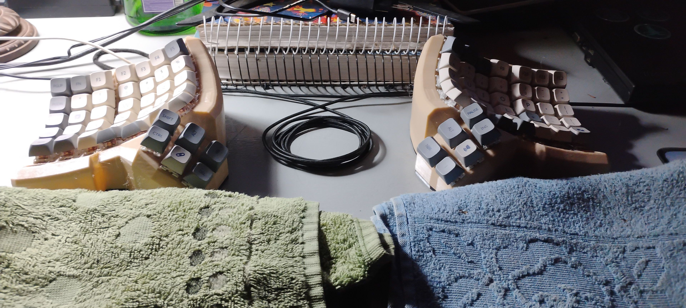
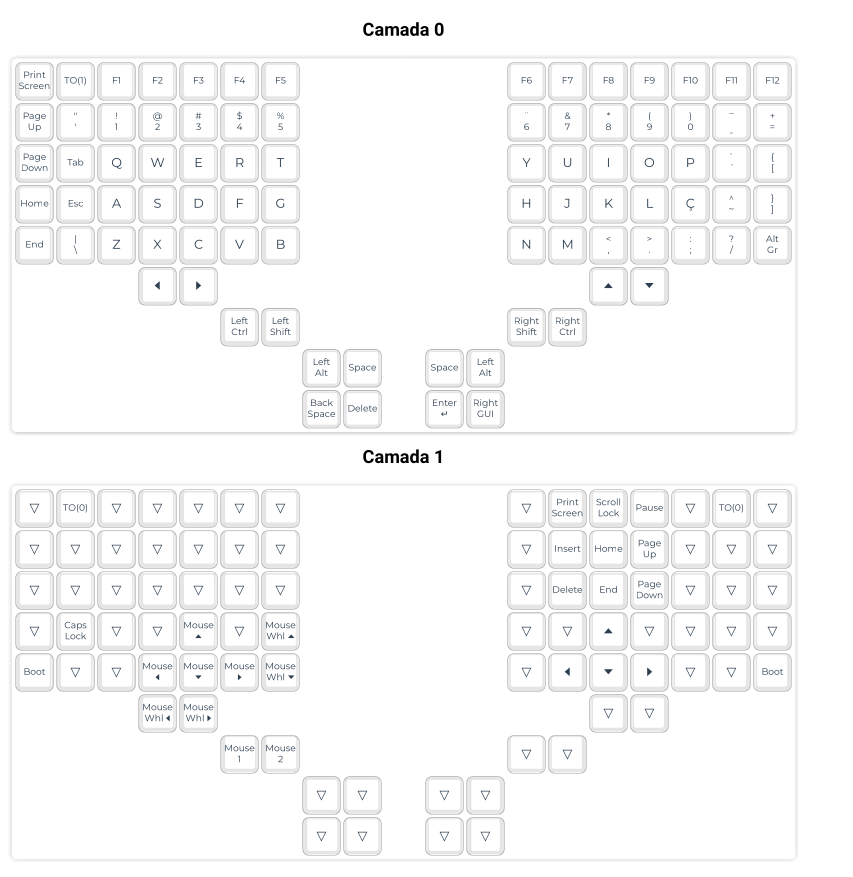
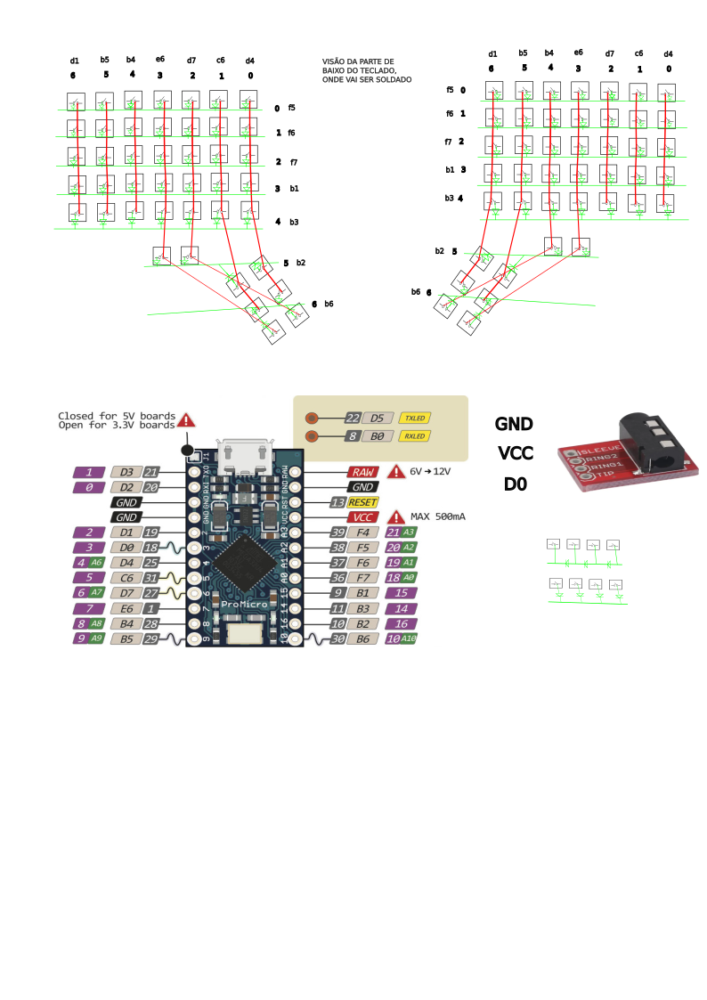

+++
title = 'Teclados divididos ergonômicos com bastante teclas são os melhores'
date = 2026-09-14T00:00:00-03:00
description = ''
tags = ['setup']
draft = false
authors = ['gabriel_chuede']
+++

Aqui pretendo compartilhar o que aprendi sobre teclados de computador,
qual o melhor teclado, o que ele deve ter para performance, ergonomia,
etc.

Primeiramente devo dizer que o teclado que você usa não importa
realmente pois a maioria do tempo será não digitando mas olhando e
pensando para o que você estiver fazendo no computador. Dito isso, tem
teclados melhores e piores, e como eu gosto dessa discussão e estava
com um teclado de membrana caindo aos pedaços e as opções na internet
são bem ruins, acabei entrando na toca do coelho, vale a pena
compartilhar o que aprendi.

Minhas preocupações são diferentes do que se poderia esperar. Estou
mais preocupado em ergonomia do que barulho ou responsividade para
jogos.

Muito do que aprendi veio do [Xah Lee](https://xahlee.info). Ele diz
que teclados devem:

- Ser divididos (split) para não precisar com os ombros curvados;

- Deve-se ter bastante teclas para o dedão, pois é o dedo mais forte e
  usar só para o espaço é muito pouco;
  
- As teclas devem ser côncavas e regulares para saber onde termina e
  começa outra tecla;

- As teclado deve ter formato côncavo e não as teclas mudar o formato
  para parecer uma côncavidade, pois do segundo modo o ponto de
  atuação do dedo vai modificar e vai tornar mais difícil apertar;

- Os switches devem ser leves e as teclas pequenas, low profile são
  melhores pois é menos esforço para apertar e a altura do teclado
  deixa a mão torta e desconfortável;

- Deixar apertado uma tecla para modificar o estado de outras é ruim
  pois é desconfortável;

- Colunas devem ser retas, pois é assim que o dedo se move. Elas só
  não são assim em teclados convencionais devido as máquinas de
  escrever que tinham motivos técnicos para isso;

- Deve-se digitar pela técnica do "touch typing";

- Não deve-se ter muitas teclas para o dedo mindinho, que é muito fraco;

Com essas informações eu decidi buscar o melhor teclado, ainda
adicionando outros pontos que considero importantes, como a
manutenabilidade do teclado, que se refere ao custo de troca de peças,
também a facilidade de montar e conseguir, a facilidade de aprender e
usar o layout e software de código aberto. Claro que vai ser dificil
achar algum que tenha todas essas qualidades ao máximo, mas vou
explorar os melhores de cada categoria e com os atributos balenceados.

Para minha sorte tem bastante comunidades de teclados que
disponibilizam instruções para montar, arquivos das cases, e o
software, que quase sempre é o [QMK](https://qmk.fm/), software de
código aberto e performático e centralizado para os diferentes
teclados.

A principio, eu pensei que um teclado split com umas 3 teclas de
dedão, 5x3, plano, com teclas MX, seria o ideal, pois eu não tinha
impressora 3D e isso dificultaria fazer as cases, com um plano eu
poderia usar sem case mesmo, e as teclas e switches low profile são
bem difíceis de encontrar e caras e basta usar um palm rest que
resolveria o problema da altura, e o número de teclas pequeno é porque
é o mínimo possível que usa as teclas mais acessíveis aos dedos (home
row e seguintes), e eu poderia usar a técnica de layers, porém layers
diferentes do shift que são desconfortáveis, layers que permanecem no
estado até apertar novamente em alguma tecla, o layout seria ruim de
aprender, mas o custo compensaria e eu poderia ter todas as teclas e
macro keys disponíveis, bastando um tempinho para lembrar do layout e
uma perca de agilidade, mas os dedos estariam confortáveis, e por isso
poderiam apertar em mais teclas por vez. Meu plano era usar várias
layers tanto para os caracters básicos quanto para atalhos de
programas, fazendo com que todos os programas operassem como se
tivessem os modos do vim, um para edição, outro para se mover, etc,
isso juntaria o teclado e o macro pad. Seria a melhor opção entre os
fatores requeridos.

Nisso, eu achei o
[Pteron36](https://github.com/harshitgoel96/pteron36-split-keyboard). O
processo de construção foi relativamente fácil, mas envolvia o uso de
PCBs que eu nunca tinha mexido. Comprei as pcbs do aliexpress, e
normalmente eles permitem imprimir no mínimo 5, o que seria bem ruim
pois tem duas partes do teclado, mas os designers dessa placa usaram
um truque de fazer uma placa servir para as duas metades, bastando
girar e usar o outro lado. Bem engenhoso. O software também foi
relativamente fácil de compilar e usar, tem até o configurador online
para gerar o layout de modo gráfico.

O problema foi na ideia das layers. O meu erro foi achar que poderia
haver uma padronização nos atalhos, assim como o ctrl c e ctrl v
funcionam em quase todos os programas. Na realidade, cada programa tem
atalhos específicos para coisas específicas, afinal cada um faz coisas
diferentes. muito pouca coisa é padronizado, o que faz com que seja
necessário muitas páginas de layers para cobrir os atalhos principais
e fica difícil organizar tudo isso para se lembrar. Além de o Emacs,
meu editor de textos, não permitir que se altere os atalhos. Você pode
até criar novos atalhos com facilidade, mas alterar os existentes é
difícil.

Portanto o ideal é achar algum teclado com muitas tecladas, evitar
usar layers de todo o tipo ao máximo. Não vai ter como escapar dos
atalhos, no máximo usar alguma layer para imitar um macropad, com os
atalhos mais usados.

Nisso, o [Dactyl](https://github.com/adereth/dactyl-keyboard), e forks
como [Dactyl-manuform](https://github.com/tshort/dactyl-keyboard),
[Dactyl carbonfet](https://github.com/carbonfet/dactyl-manuform), me
pareceram interessantes, pois eu ja estava para comprar uma impressora
3D por outros motivos, e eles eram o ápice da ergonomia, com seu
formato côncavo. Além de permitirem configuração de quantidade de
teclas, devido a seu case ser gerado por código. O problema é que tem
que ser "handwired", o que exige mais solda e complica um pouco o
processo de montagem, mas pelo lado do custo isso era bom pois as PCBs
estavam ficando caras. 

Escolhi o Carbonfet devido a ser configurável, mais bonito e fácil de
montar do que o Dactyl original. Configurei com 7 colunas, 6 rows, e
com inner-column false, pois dava um número bom de teclas e a
inner-column, apesar de ser mais ergônomica pois usa o dedo indicador
ao invés do mindinho, complicava muito o layout, pois estragava a
ordem dos números e acentos. além disso, já tem preconfiguração desse
layout no qmk, não precisaria fazer o código.

Para o layout deixei a maioria no padrão qwerty, tirando os enters,
space, ctrl, alt e shift e movendo para as teclas do polegar. Sobre
uns espaços estranhos na coluna mais a esquerda e nas últimas rows que
uso para home, etc. e setas cima, baixo, etc. que ficam meio ruins,
mas no geral vale a pena, não são teclas muito usadas e da para se
acostumar.

Como o teclado é handwired e configurável, fica difícil reutilizar o
firmware, e portanto tem-se que modificar você mesmo os existentes
para se adequar a quantas teclas você tem e como estão dispostas no
circuito. Não vem junto o holder do arduino pro micro mas da para
achar facilmente na internet ou fazer você mesmo.

Enfim, acho que esse é o melhor teclado possível que se pode usar,
considerando todos os fatores mencionados. É muito confortável,
divertido de digitar e tira a necessidade de ficar com uma postura
ruim.

Porém, acho que como recomendação geral o melhor seria algum teclado
igual ao meu dactyl porém plano, pois o dactyl é mais ergonômico
quando digitando, porém um plano é melhor para quando só se quer
digitar alguns atalhos e usar o mouse, não precisa ficar na posição
certa para digitar, além de ser mais fácil a montagem com pcb, e ser
mais fácil de transportar (não que isso seja uma granda vantagem mas
não é ruim de se ter). Split, plano com bastante teclas.

acho que o endgame dos teclados seria um que tivesse um trackpoint e
botões de mouse, sendo split, bastante teclas, ortho e concavo como o
dactyl. usei o trackpint dos teclados do thinkpad e posso dizer que
ajuda muito não precisar tirar a mão do teclado para usar o mouse,
porém não se acha teclados com esse trackpoint fora dos thinkpads, não
sei se é problema de patente ou o que. tem também os modelos com
trackball imbutida que parecem fazer o mesmo efeito, teria que testar
se é realmente bom.

