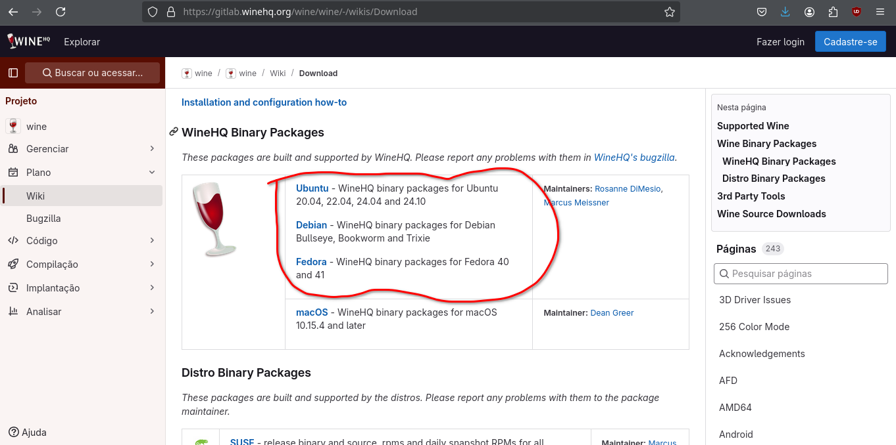
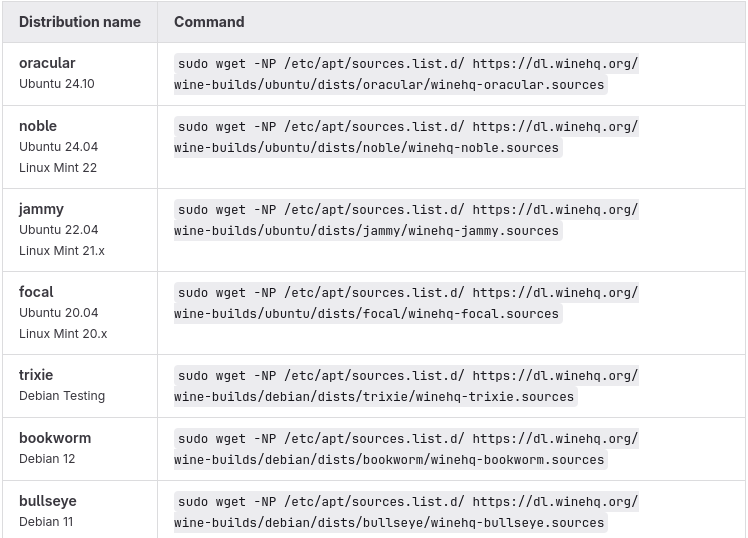

+++
title = 'Usando Amplitube e VST com linux!'
date = 2025-04-15T10:42:01-03:00
description = 'Guia para usar plugins vst do Windows no linux, mais especificamente o Amplitube'
tags = ['linux','vst','windows','amplitube']
draft = false
authors = ['rafael_chuede']
+++

	
## Plugins vst do windows no Linux
Sim, é totalmente possivel usar plugins como Amplitube, Ezdrummer e praticamente qualquer plugins feito para windows no linux. Você somente precisará de dois programas, além do seu plugin: 
- Wine: Programa famoso usado para rodar programas windows como '.exe'.
- Yabridge: Programa usado para conseguir usar plugins '.vst' e '.vst3' com linux.
### Instalação do Wine
Primeiro, instale o `Wine Staging`, para isso você pode seguir a documentação para instalar o Wine de acordo com sua distro: https://gitlab.winehq.org/wine/wine/-/wikis/Download. 

Abra a pagina de acordo com sua distro:



Você pode seguir os passos da página, mas vou relatar todos aqui para ficar mais organizado:
1. Habilite a arquitetura 32 bits no seu sistema com o comando:
```
sudo dpkg --add-architecture i386
```
2. Baixe e adicione a chave do repositório:
```
sudo mkdir -pm755 /etc/apt/keyrings
wget -O - https://dl.winehq.org/wine-builds/winehq.key | sudo gpg --dearmor -o /etc/apt/keyrings/winehq-archive.key -
```
3. Adicione o repositório de acordo com sua distro:



No meu caso, estou usando Debian 12 Bookworm, então vou usar o comando:
```
sudo wget -NP /etc/apt/sources.list.d/ https://dl.winehq.org/wine-builds/debian/dists/bookworm/winehq-bookworm.sources
```
4. Atualize os repositórios:
```
sudo apt update
```
5. instale o Wine Staging:
```
sudo apt install --install-recommends winehq-staging
```
6. *IMPORTANTE* desatualize o wine staging:\
As novas versões do wine staging não costumam funcionar com alguns plugins, na versão 9.10 a maioria dos plugins parece funcionar muito bem. Você pode testar várias versões com o comando abaixo, somente mudando o número da versão:
```
variant=staging
version=9.10
codename=$(shopt -s nullglob; awk '/^deb https:\/\/dl\.winehq\.org/ { print $3; exit 0 } END { exit 1 }' /etc/apt/sources.list /etc/apt/sources.list.d/*.list || awk '/^Suites:/ { print $2; exit }' /etc/apt/sources.list /etc/apt/sources.list.d/wine*.sources)
suffix=$(dpkg --compare-versions "$version" ge 6.1 && ((dpkg --compare-versions "$version" eq 6.17 && echo "-2") || echo "-1"))
sudo apt install --install-recommends {"winehq-$variant","wine-$variant","wine-$variant-amd64","wine-$variant-i386"}="$version~$codename$suffix"
```
7. Manter a versão escolhida sem atualizar automaticamente:
```
sudo apt-mark hold wine-staging-amd64 wine-staging-i386:i386 winehq-staging
```
# Instalação do Yabridge

Você pode instalar o yabridge com alguns poucos comandos:

1. Baixe o pacote yabridge.tar.gz mais recente no link: https://github.com/robbert-vdh/yabridge/releases.
2. Extraia o conteudo do arquivo baixado para "~/.local/share/":
```
tar -C ~/.local/share -xavf ~/Downloads/nome-do-arquivo-baixado
```
3. Coloque o yabridge no path do seu terminal:
```
sudo nano ~/.bashrc
```
vá até o final do arquivo  e escreva a linha `export PATH="$PATH:$HOME/.local/share/yabridge"`, salve o arquivo e reabra seu terminal.

4. PRONTO, você já pode rodar comandos yabridgectl no terminal.
### Adicionar plugins com yabridgectl
Para plugins vst você provavelmente tem uma pasta com eles, adicione o caminho dessa pasta para o yabridge com:
```
yabridgectl add "caminho/da/pasta/de/vsts"
```
Agora sincronize os plugins com:
```
yabridgectl sync
```
Pronto seus plugins estão prontos para o o uso, cada vez que adicionar um plugin novo a essa pasta apenas rode o último comando novamente. Não esqueça de especificar esse caminho também para sua DAW.
# Baixando e instalando Amplitube 4
o Download do amplitube 4 pode ser difícil de achar atualmente, por sorte tenho uma cópia que pode ser baixada no link:
https://drive.google.com/file/d/1EFpMlxQpj3h08xGblwz9VqA5XLH2EXEz/view?usp=sharing.

O pacote zip ja contém um keygen para ativar a versão com todos os amplificadores do amplitube, sinta-se livre para usar.
Para instalar o amplitube baixado apenas extraia o conteúdo e execute o arquive amplitube.exe abrindo ele com o Wine, e siga a instalação como se estivesse no windows.

yDepois de instalar você vai precisar passar a pasta em que o amplitube foi instalado para o yabridge, se você instalou de forma padrão a pasta deve ser: "/home/rafael/.wine/drive_c/Program Files/VstPlugIns/" e deve conter o arquivo "Amplitube4.dll", se tudo estiver certo apenas passe este diretório com 
```
yabridgectl add "/home/rafael/.wine/drive_c/Program Files/VstPlugIns/"
```
depois
```
yabridgectl sync
``` 
e tudo deve estar certo, pode abrir sua DAW e testar.

